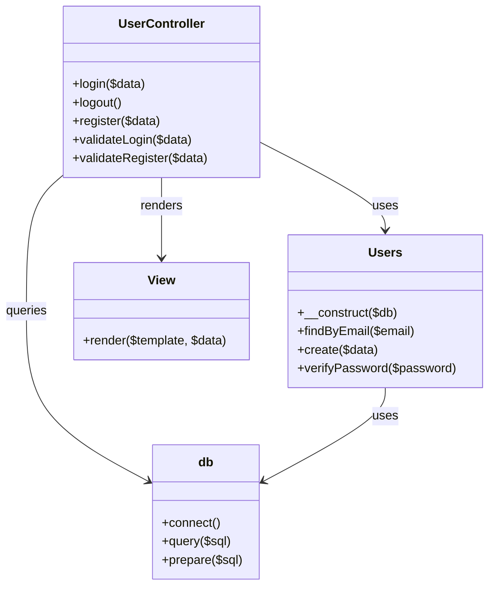
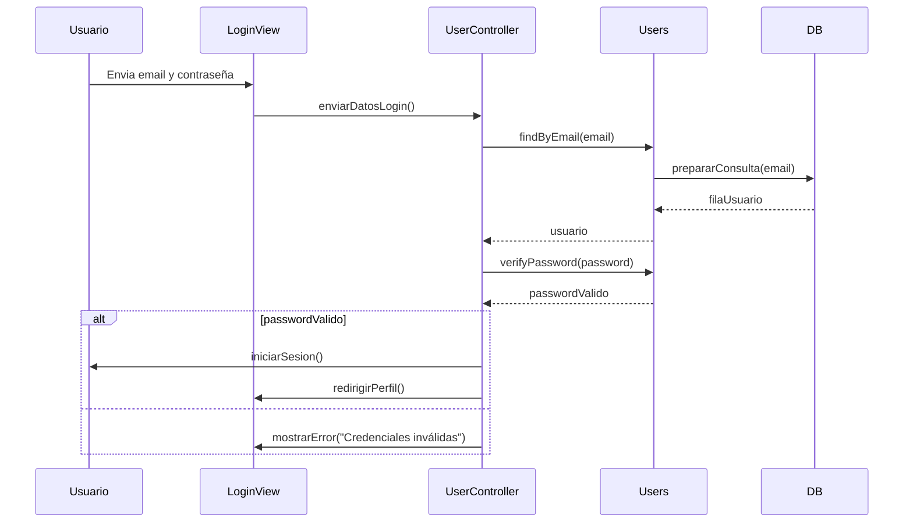
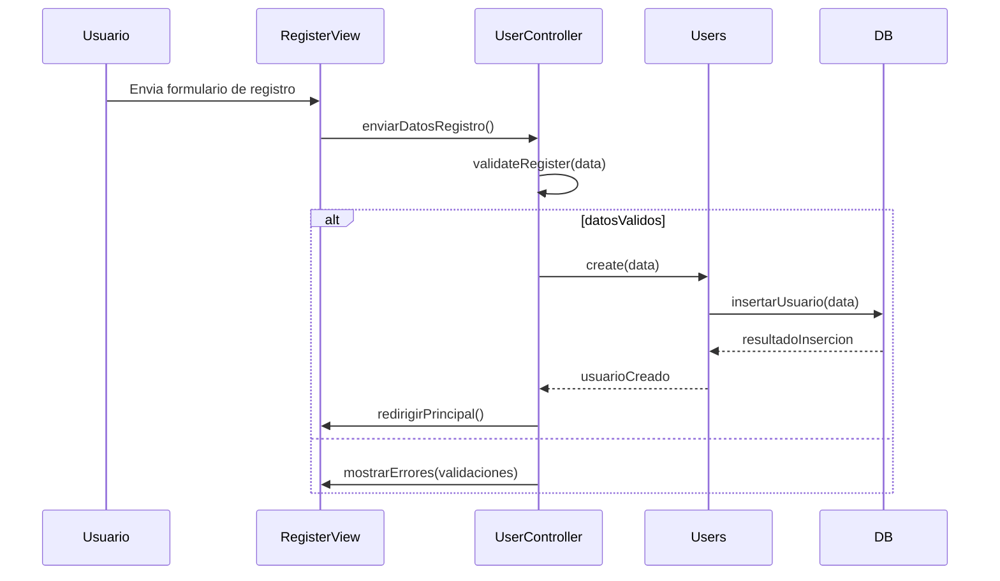

# DAM Transversal Backend

## Introducción
Este proyecto implementa el registro, login/logout y gestión de usuarios con una estructura MVC en PHP. Se utiliza MySQLi orientado a objetos para acceder a la base de datos y se maneja la autenticación basada en sesión.

## Funcionalidades
- Login para los distintos tipos de usuario desde un único formulario.
- Registro de nuevos usuarios con validación en servidor.
- Logout con cierre de sesión y redirección a login.
- Acceso restringido a páginas privadas según estado de sesión.
- Diferenciación de vistas y acciones para usuarios admin y estándar.
- Estructura de carpetas MVC: `model/`, `view/`, `controller/`.

## Cómo funciona

### Diagrama de Clases

### Diagrama de Secuencia: Login

### Diagrama de Secuencia: Registro

## Uso general
1. Configurar la conexión MySQL en `config.php`.
2. Importar la base de datos desde `model/Monogatarya_BD.sql`.
3. Abrir `index.php` y acceder al formulario de login.
4. Registrar nuevos usuarios desde las vistas de registro.
5. Usar el botón de logout para cerrar la sesión.

## Notas
- `UserController` contiene las funciones `login`, `logout` y `register`.
- La validación de entrada se realiza en el controlador antes de consultar la base de datos.
- Se evita el acceso a rutas privadas cuando el usuario no está autenticado.
