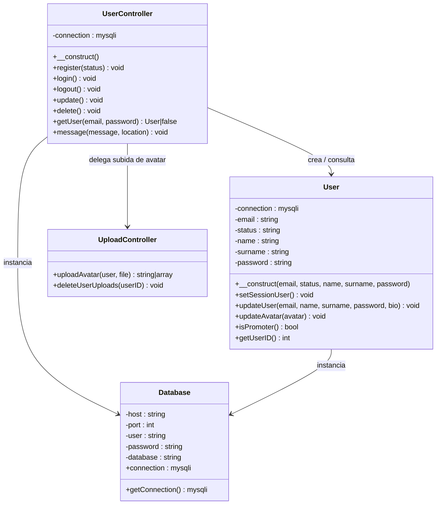
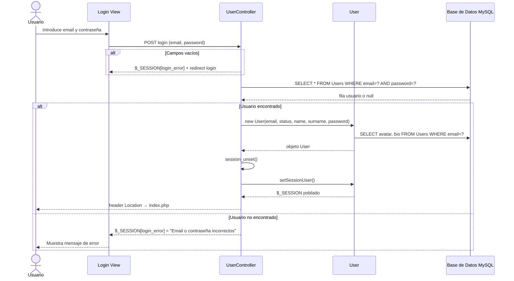
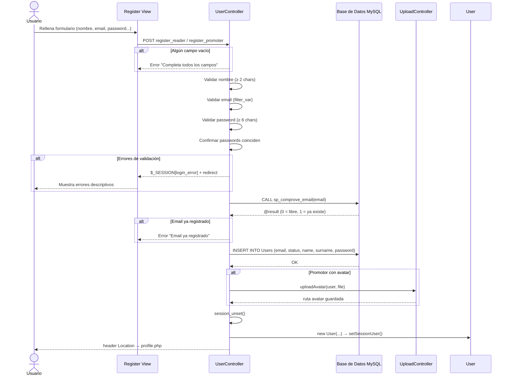
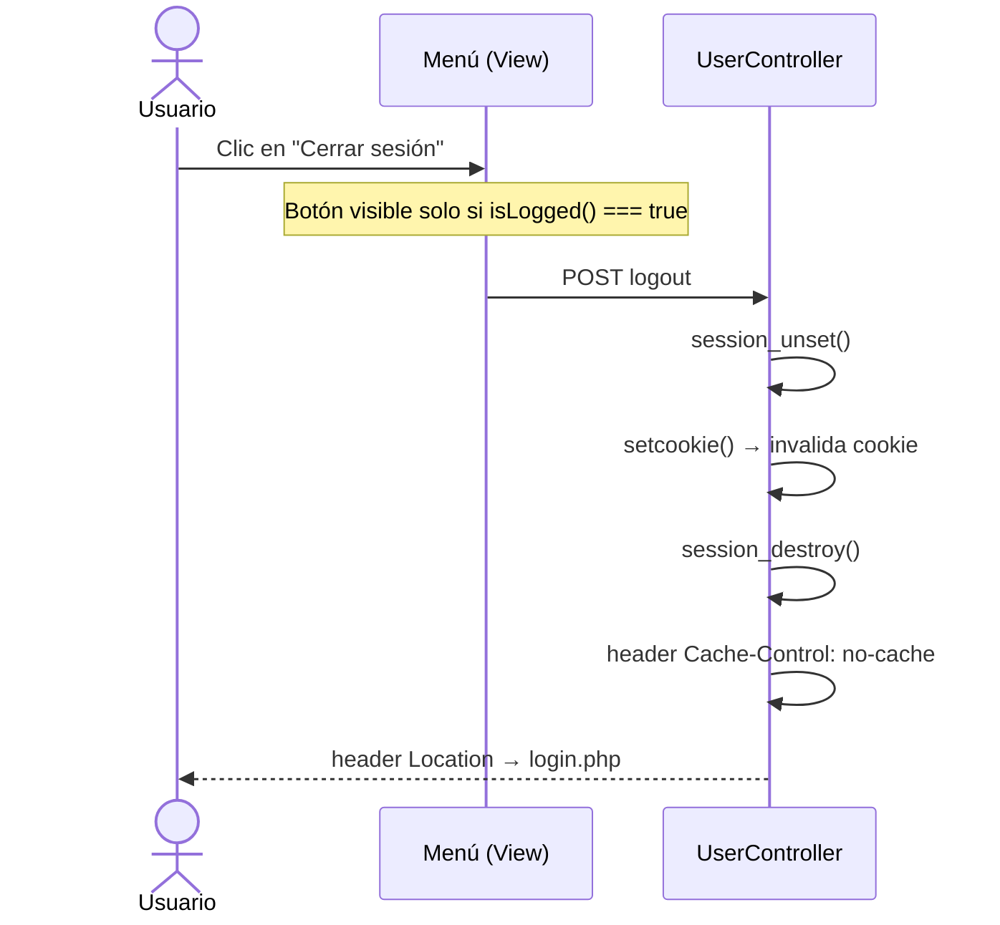

# Monogatarya — Práctica 5: Login, Registro y Logout (MySQLi)

### Sitio (demo)
https://monogatarya.run.place/

## Introducción

**Monogatarya** es una aplicación web para gestionar contenido manga/anime, desarrollada en PHP siguiendo la arquitectura MVC. Esta práctica implementa el sistema de autenticación (login, registro y logout) conectando los formularios con una base de datos MySQL usando **MySQLi orientado a objetos**.

Tipos de usuario:
- **Lector** (`reader`): usuario estándar que explora catálogos y gestiona su perfil.
- **Promotor** (`promoter`): usuario con permisos adicionales para gestionar obras, eventos y subir avatar.

---

## Funcionalidades

### Login (RF1)
- Formulario único de login para ambos tipos (`view/auth/login.php`).
- Verificación de email y contraseña contra la base de datos.
- Redirección al perfil (`view/profile.php`) si las credenciales son correctas.
- Mensajes de error descriptivos para credenciales inválidas.
- Protección de páginas privadas mediante `requireLogin()` y `requireRole()`.
- Permisos: el promotor accede a funcionalidades adicionales; el lector, solo a catálogos y perfil.

### Registro (RF2)
- Formularios de registro según tipo de usuario:
  - `view/auth/register-reader.php` → lector (status = 0)
  - `view/auth/register-promoter.php` → promotor (status = 1)
- Inserción del usuario en la base de datos con los datos del formulario.
- Redirección a `index.php` tras un registro exitoso.
- Mensajes de error descriptivos en fallos de validación (nombre, email, contraseña, confirmación).
- El promotor puede subir un avatar durante registro o edición de perfil.

### Logout (RF3)
- Botón de cerrar sesión visible solo si el usuario está logueado (`isLogged()`).
- Limpieza de sesión con `session_unset()` y `session_destroy()`.
- Invalidación de la cookie de sesión.
- Redirección a `view/auth/login.php`.

### Requisitos no funcionales (RNF4)
- Toda la información se almacena y consulta desde MySQL.
- Uso de **MySQLi orientado a objetos** (`new mysqli(...)`).
- Estructura de carpetas basada en MVC: `model/`, `view/`, `controller/`, `core/`.
- `UserController` contiene los métodos `login()`, `logout()` y `register()`.
- Validaciones servidor: email (`filter_var`) y contraseña (≥ 6 caracteres).

---

## Cómo funciona

### Estructura de carpetas

```
DAM-Transversal/
├── controller/
│   ├── UserController.php      # Lógica de autenticación
│   ├── CatalogController.php
│   └── UploadController.php
├── core/
│   ├── config.php              # Constantes de rutas y URLs
│   ├── database.php            # Clase Database (MySQLi OO)
│   └── auth.php                # Funciones de control de sesión
├── model/
│   ├── User.php                # Clase User
│   ├── Chapters.php
│   ├── Events.php
│   └── Monogatarya_BD.sql      # Script SQL de la base de datos
└── view/
    ├── auth/
    │   ├── login.php
    │   ├── register.html
    │   ├── register-reader.php
    │   └── register-promoter.php
    ├── catalogs/
    ├── includes/
    │   ├── header.php
    │   ├── menu.php            # Botón logout condicional
    │   └── footer.php
    ├── profile.php
    └── index.php
```

---

### Diagrama de clases — User


```mermaid
classDiagram
    class Database {
        -host : string
        -port : int
        -user : string
        -password : string
        -database : string
        +connection : mysqli
        +getConnection() mysqli
    }

    class User {
        -connection : mysqli
        -email : string
        -status : string
        -name : string
        -surname : string
        -password : string
        +__construct(email, status, name, surname, password)
        +setSessionUser() void
        +updateUser(email, name, surname, password, bio) void
        +updateAvatar(avatar) void
        +isPromoter() bool
        +getUserID() int
    }

    class UserController {
        -connection : mysqli
        +__construct()
        +register(status) void
        +login() void
        +logout() void
        +update() void
        +delete() void
        +getUser(email, password) User|false
        +message(message, location) void
    }

    class UploadController {
        +uploadAvatar(user, file) string|array
        +deleteUserUploads(userID) void
    }

    UserController --> Database : instancia
    UserController --> User : crea / consulta
    UserController --> UploadController : delega subida de avatar
    User --> Database : instancia
```

---

### Diagrama de secuencia — Login


```mermaid
sequenceDiagram
    actor Usuario
    participant login.php as Login View
    participant UserController
    participant User
    participant DB as Base de Datos MySQL

    Usuario->>login.php: Introduce email y contraseña
    login.php->>UserController: POST login (email, password)

    alt Campos vacíos
        UserController-->>login.php: $_SESSION[login_error] + redirect login
    end

    UserController->>DB: SELECT * FROM Users WHERE email=? AND password=?
    DB-->>UserController: fila usuario o null

    alt Usuario encontrado
        UserController->>User: new User(email, status, name, surname, password)
        User->>DB: SELECT avatar, bio FROM Users WHERE email=?
        User-->>UserController: objeto User
        UserController->>UserController: session_unset()
        UserController->>User: setSessionUser()
        User-->>UserController: $_SESSION poblado
        UserController-->>Usuario: header Location → index.php
    else Usuario no encontrado
        UserController-->>login.php: $_SESSION[login_error] = "Email o contraseña incorrectos"
        login.php-->>Usuario: Muestra mensaje de error
    end
```

---

### Diagrama de secuencia — Registro


```mermaid
sequenceDiagram
    actor Usuario
    participant register.php as Register View
    participant UserController
    participant DB as Base de Datos MySQL

    Usuario->>register.php: Rellena formulario (nombre, email, password...)
    register.php->>UserController: POST register_reader / register_promoter

    alt Algún campo vacío
        UserController-->>register.php: Error "Completa todos los campos"
    end

    UserController->>UserController: Validar nombre (≥ 2 chars)
    UserController->>UserController: Validar email (filter_var)
    UserController->>UserController: Validar password (≥ 6 chars)
    UserController->>UserController: Confirmar passwords coinciden

    alt Errores de validación
        UserController-->>register.php: $_SESSION[login_error] + redirect
        register.php-->>Usuario: Muestra errores descriptivos
    end

    UserController->>DB: CALL sp_comprove_email(email)
    DB-->>UserController: @result (0 = libre, 1 = ya existe)

    alt Email ya registrado
        UserController-->>register.php: Error "Email ya registrado"
    end

    UserController->>DB: INSERT INTO Users (email, status, name, surname, password)
    DB-->>UserController: OK

    alt Promotor con avatar
        UserController->>UploadController: uploadAvatar(user, file)
        UploadController-->>UserController: ruta avatar guardada
    end

    UserController->>UserController: session_unset()
    UserController->>User: new User(...) → setSessionUser()
    UserController-->>Usuario: header Location → profile.php
```

---

### Diagrama de secuencia — Logout


```mermaid
sequenceDiagram
    actor Usuario
    participant menu.php as Menú (View)
    participant UserController

    Usuario->>menu.php: Clic en "Cerrar sesión"
    note over menu.php: Botón visible solo si isLogged() === true
    menu.php->>UserController: POST logout

    UserController->>UserController: session_unset()
    UserController->>UserController: setcookie() → invalida cookie
    UserController->>UserController: session_destroy()
    UserController->>UserController: header Cache-Control: no-cache
    UserController-->>Usuario: header Location → login.php
```

---

## 🌐 Demo en vivo
https://monogatarya.run.place/

## Instalación y uso

1. Importar la base de datos: ejecutar `model/Monogatarya_BD.sql` en MySQL.
2. Configurar credenciales de conexión en `core/database.php` si es necesario.
3. Desplegar en servidor local (XAMPP / Apache) en la ruta `/DAM-Transversal/`.
4. Acceder a `view/auth/login.php` para iniciar sesión.
5. Desde `view/auth/register.html` elegir el tipo de usuario para registrarse.
6. El botón **Cerrar sesión** aparece en el menú lateral solo cuando hay sesión activa.

---

## Notas técnicas

| Aspecto | Detalle |
|---|---|
| Lenguaje | PHP 8+ |
| Lenguaje | PHP 8+ |
| Base de datos | MySQL con MySQLi Object-Oriented |
| Sesiones | `$_SESSION` gestionadas en `UserController` y `User` |
| Control de acceso | `auth.php` → `requireLogin()`, `requireRole()`, `isLogged()` |
| Validaciones servidor | email (`filter_var`), password (≥6 chars), nombre (≥2 chars) |
| Subida de imágenes | Solo promotores, gestionada por `UploadController` |
| Stored procedures | `sp_comprove_email`, `sp_update_user` |
